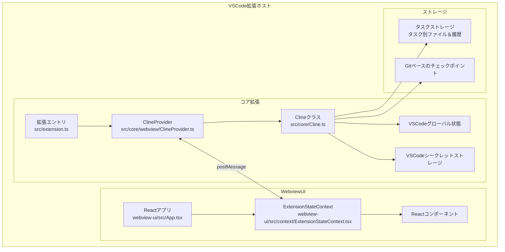

# Cline システムアーキテクチャ

## 全体アーキテクチャ概要

Clineは、VSCode拡張機能として実装されており、コア拡張バックエンドとReactベースのWebviewフロントエンドの組み合わせで構成されています。このアーキテクチャにより、VSCodeの強力な拡張機能APIを活用しながら、モダンなユーザーインターフェースを提供することが可能になっています。



## コンポーネント内訳

### コア拡張（バックエンド）

1. **拡張エントリポイント** (`src/extension.ts`)
   - 拡張機能の初期化と登録
   - コマンドとイベントリスナーの設定
   - ClineProviderのインスタンス化

2. **ClineProvider** (`src/core/webview/ClineProvider.ts`)
   - 拡張機能の状態管理の中心
   - WebviewとVSCode拡張間の通信管理
   - 永続的なストレージ（グローバル状態、ワークスペース状態、シークレット）の管理

3. **Clineクラス** (`src/core/Cline.ts`)
   - タスク実行ループの管理
   - ツール実行の調整
   - APIリクエストとレスポンスの処理
   - メッセージストリーミングの管理

4. **統合サービス** (`src/integrations/`)
   - ターミナル管理 (`terminal/`)
   - チェックポイント管理 (`checkpoints/`)
   - エディタ操作 (`editor/`)
   - ワークスペース操作 (`workspace/`)

5. **サービス** (`src/services/`)
   - ブラウザセッション管理 (`browser/`)
   - MCP（Model Context Protocol）サーバー管理 (`mcp/`)
   - ログ記録 (`logging/`)
   - テレメトリ (`telemetry/`)

### Webview UI（フロントエンド）

1. **Reactアプリ** (`webview-ui/src/App.tsx`)
   - UIのエントリポイント
   - ルーティングと全体レイアウト

2. **ExtensionStateContext** (`webview-ui/src/context/ExtensionStateContext.tsx`)
   - 拡張機能の状態へのアクセスを提供
   - メッセージイベントによるリアルタイム更新の処理
   - 部分的なメッセージ更新の管理
   - 状態変更のためのメソッド提供

3. **Reactコンポーネント** (`webview-ui/src/components/`)
   - チャットインターフェース
   - ツール承認UI
   - 設定パネル
   - タスク履歴表示

### ストレージシステム

1. **タスクストレージ**
   - 各タスクに固有のIDと専用のストレージディレクトリ
   - 会話履歴の保存
   - ターミナル出力とブラウザ状態の保存

2. **チェックポイントシステム**
   - Gitベースのファイル変更追跡
   - ツール実行後のチェックポイント作成
   - 任意のチェックポイントへの状態復元
   - チェックポイント間の変更比較

## 通信とデータフロー

### コア拡張内のデータフロー

1. **状態管理**
   - ClineProviderが拡張機能の状態の単一の情報源として機能
   - グローバル状態、ワークスペース状態、シークレットの管理
   - コンポーネント間の状態更新の調整
   - 複数の拡張インスタンス間での状態の一貫性確保

2. **タスク実行ループ**
   ```typescript
   class Cline {
     async initiateTaskLoop(userContent: UserContent, isNewTask: boolean) {
       while (!this.abort) {
         // 1. APIリクエストを行い、レスポンスをストリーミング
         const stream = this.attemptApiRequest()

         // 2. コンテンツブロックの解析と表示
         for await (const chunk of stream) {
           switch (chunk.type) {
             case "text":
               // コンテンツブロックに解析
               this.assistantMessageContent = parseAssistantMessage(chunk.text)
               // ブロックをユーザーに表示
               await this.presentAssistantMessage()
               break
           }
         }

         // 3. ツール実行の完了を待機
         await pWaitFor(() => this.userMessageContentReady)

         // 4. ツール結果でループを継続
         const recDidEndLoop = await this.recursivelyMakeClineRequests(
           this.userMessageContent
         )
       }
     }
   }
   ```

3. **ツール実行フロー**
   ```typescript
   class Cline {
     async executeToolWithApproval(block: ToolBlock) {
       // 1. 自動承認設定の確認
       if (this.shouldAutoApproveTool(block.name)) {
         await this.say("tool", message)
         this.consecutiveAutoApprovedRequestsCount++
       } else {
         // 2. ユーザー承認のリクエスト
         const didApprove = await askApproval("tool", message)
         if (!didApprove) {
           this.didRejectTool = true
           return
         }
       }

       // 3. ツールの実行
       const result = await this.executeTool(block)

       // 4. チェックポイントの保存
       await this.saveCheckpoint()

       // 5. 結果をAPIに返す
       return result
     }
   }
   ```

### Webview UIとコア拡張間の通信

1. **メッセージパッシング**
   - VSCodeのpostMessageシステムを使用した双方向通信
   - 型安全なメッセージ構造
   - 非同期メッセージ処理

2. **状態同期**
   - WebviewリロードでのExtensionStateContextの再初期化
   - リアルタイム更新のためのイベントリスナー
   - 部分的な状態更新の効率的な処理

## デプロイメントアーキテクチャ

Clineは、VSCode拡張機能としてデプロイされ、以下の方法で配布されます：

1. **VS Marketplace**
   - 公式のVisual Studio Marketplaceを通じた配布
   - 自動更新メカニズム
   - バージョン管理と互換性チェック

2. **ローカル開発**
   - `npm run install:all`でローカル開発環境をセットアップ
   - `F5`キーでデバッグモードで起動
   - ホットリロードによる開発効率の向上

## スケーラビリティとパフォーマンス

1. **コンテキストウィンドウ管理**
   - リクエスト間のトークン使用量の追跡
   - 必要に応じた会話の自動切り詰め
   - 重要なコンテキストの保持とスペースの解放
   - 異なるモデルコンテキストサイズの処理

2. **ストリーミングアーキテクチャ**
   - リアルタイムチャンク処理
   - 部分的なコンテンツ処理
   - 競合状態の防止
   - ストリーミング中のエラー回復

3. **タスク状態管理**
   - 各タスクに固有のIDと専用のストレージディレクトリ
   - 会話履歴のメッセージごとの保存
   - Gitベースのチェックポイントによるファイル変更の追跡
   - ターミナル出力とブラウザ状態の保存

## セキュリティとコンプライアンス

1. **ユーザー承認システム**
   - すべてのファイル変更とコマンド実行に対するユーザー承認
   - 潜在的に影響の大きい操作の明示的な承認要求
   - 自動承認設定のカスタマイズ可能性

2. **シークレット管理**
   - VSCodeのシークレットストレージを使用したAPIキーの安全な保存
   - 機密情報の暗号化
   - トークンの安全な処理

3. **ファイルアクセス制御**
   - `.clineignore`ファイルによるアクセス制限
   - 特定のファイルやディレクトリへのアクセスの防止
   - ユーザー定義のアクセス制御ルール

## 統合ポイント

1. **AI APIプロバイダー**
   - OpenRouter
   - Anthropic
   - OpenAI
   - Google Gemini
   - AWS Bedrock
   - Azure
   - GCP Vertex
   - その他のOpenAI互換API
   - LM Studio/Ollamaを通じたローカルモデル

2. **MCP（Model Context Protocol）サーバー**
   - カスタムツールの作成と統合
   - 外部APIとの接続
   - 機能拡張のためのプラグインシステム

3. **ブラウザ自動化**
   - Puppeteerを使用したブラウザ制御
   - スクリーンショットとコンソールログの取得
   - ウェブページとの対話

4. **ターミナル統合**
   - VSCodeターミナルAPIを使用したコマンド実行
   - リアルタイム出力ストリーミング
   - 長時間実行プロセスの管理
