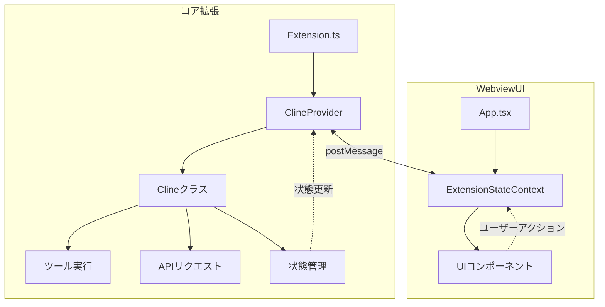
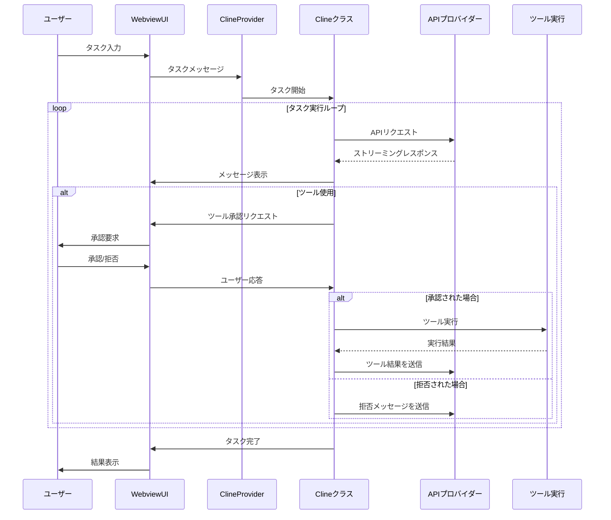
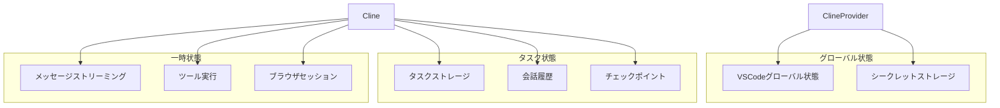

# Cline システムパターン

## アーキテクチャパターン

Clineは、以下の主要なアーキテクチャパターンを採用しています：

1. **モジュラーアーキテクチャ**
   - 機能ごとに分離されたモジュール
   - 明確に定義されたインターフェース
   - 疎結合な設計

2. **MVCパターンの変形**
   - モデル: ClineProviderとClineクラスによる状態管理
   - ビュー: Reactコンポーネントによるユーザーインターフェース
   - コントローラー: メッセージハンドラとイベントリスナー

3. **イベント駆動アーキテクチャ**
   - メッセージパッシングによる通信
   - イベントリスナーによる状態更新
   - 非同期処理の広範な使用

4. **プラグインアーキテクチャ**
   - MCP（Model Context Protocol）によるツール拡張
   - APIプロバイダーの抽象化と拡張性
   - 機能の動的追加

## 主要な技術的決定

### 1. VSCode拡張機能とWebviewの組み合わせ

**決定**: コア機能をTypeScriptで実装されたVSCode拡張機能として、UIをReactベースのWebviewとして実装する。

**理由**:
- VSCodeのAPIへの直接アクセスが可能
- モダンなUIフレームワーク（React）の利用
- 明確な関心の分離
- 拡張性と保守性の向上

**トレードオフ**:
- Webviewとコア拡張間の通信オーバーヘッド
- 状態同期の複雑さ
- 二重の依存関係管理（拡張とWebview）

### 2. タスク単位の状態分離

**決定**: 各タスクを独立したClineクラスのインスタンスで実行し、タスク固有の状態を分離する。

**理由**:
- タスク間の状態干渉を防止
- 並行タスクの安全な実行
- タスク状態の永続化と復元の簡素化
- エラー分離と回復の容易化

**トレードオフ**:
- メモリ使用量の増加
- インスタンス管理の複雑さ
- 共有リソースへのアクセス調整の必要性

### 3. Gitベースのチェックポイントシステム

**決定**: ファイル変更を追跡し、チェックポイントを作成するためにGitを使用する。

**理由**:
- 変更の詳細な追跡
- 任意のポイントへの復元機能
- 差分表示の標準化
- 既存のバージョン管理システムの活用

**トレードオフ**:
- Gitへの依存性
- 大規模プロジェクトでのパフォーマンス影響
- 非ファイル状態（ターミナル、ブラウザ）の別途管理の必要性

### 4. ストリーミングアーキテクチャ

**決定**: AIレスポンスをリアルタイムでストリーミングし、部分的なコンテンツを処理する。

**理由**:
- 即時のユーザーフィードバック
- 長いレスポンスでの応答性の向上
- ツール実行の早期開始
- ユーザー体験の向上

**トレードオフ**:
- 複雑な状態管理
- 部分的なコンテンツ処理の難しさ
- 競合状態の可能性

### 5. ヒューマンインザループのアプローチ

**決定**: すべてのファイル変更とコマンド実行にユーザー承認を要求する。

**理由**:
- セキュリティの向上
- ユーザー制御の維持
- 透明性の確保
- 学習機会の提供

**トレードオフ**:
- 自動化の制限
- ユーザー介入の増加
- 処理速度の低下

## 設計パターン

Clineの実装では、以下の設計パターンが使用されています：

### 1. シングルトンパターン

**使用例**: ClineProvider

```typescript
// シングルトンパターンの実装
export class ClineProvider {
  private static instance: ClineProvider | undefined;

  public static getInstance(context: vscode.ExtensionContext): ClineProvider {
    if (!ClineProvider.instance) {
      ClineProvider.instance = new ClineProvider(context);
    }
    return ClineProvider.instance;
  }

  private constructor(private context: vscode.ExtensionContext) {
    // 初期化ロジック
  }
}
```

**目的**:
- 拡張機能の状態の単一の情報源を確保
- グローバルアクセスポイントの提供
- インスタンスの制御

### 2. ファクトリーパターン

**使用例**: APIプロバイダーの作成

```typescript
// ファクトリーパターンの実装
export function createApiProvider(
  type: ApiProviderType,
  config: ApiConfig
): ApiProvider {
  switch (type) {
    case "anthropic":
      return new AnthropicProvider(config);
    case "openai":
      return new OpenAIProvider(config);
    case "gemini":
      return new GeminiProvider(config);
    // その他のプロバイダー
    default:
      throw new Error(`Unknown API provider type: ${type}`);
  }
}
```

**目的**:
- オブジェクト作成ロジックの抽象化
- 実装の詳細からのクライアントコードの分離
- 新しいプロバイダーの容易な追加

### 3. オブザーバーパターン

**使用例**: メッセージイベントとリスナー

```typescript
// オブザーバーパターンの実装
class MessageManager {
  private listeners: Map<string, Function[]> = new Map();

  public addListener(event: string, callback: Function): void {
    if (!this.listeners.has(event)) {
      this.listeners.set(event, []);
    }
    this.listeners.get(event)!.push(callback);
  }

  public notify(event: string, data: any): void {
    if (this.listeners.has(event)) {
      for (const callback of this.listeners.get(event)!) {
        callback(data);
      }
    }
  }
}
```

**目的**:
- イベント駆動通信の実現
- コンポーネント間の疎結合の維持
- 状態変更の通知

### 4. ストラテジーパターン

**使用例**: ツール実行

```typescript
// ストラテジーパターンの実装
interface ToolExecutor {
  execute(params: any): Promise<ToolResult>;
}

class ReadFileExecutor implements ToolExecutor {
  async execute(params: { path: string }): Promise<ToolResult> {
    // ファイル読み取りロジック
  }
}

class WriteToFileExecutor implements ToolExecutor {
  async execute(params: { path: string, content: string }): Promise<ToolResult> {
    // ファイル書き込みロジック
  }
}

// ツール実行の中央管理
class ToolManager {
  private executors: Map<string, ToolExecutor> = new Map();

  constructor() {
    this.executors.set("read_file", new ReadFileExecutor());
    this.executors.set("write_to_file", new WriteToFileExecutor());
    // その他のツール
  }

  async executeTool(name: string, params: any): Promise<ToolResult> {
    if (!this.executors.has(name)) {
      throw new Error(`Unknown tool: ${name}`);
    }
    return this.executors.get(name)!.execute(params);
  }
}
```

**目的**:
- 異なるツール実装の抽象化
- 実行時のアルゴリズム選択
- 新しいツールの容易な追加

### 5. コマンドパターン

**使用例**: ターミナルコマンド実行

```typescript
// コマンドパターンの実装
interface Command {
  execute(): Promise<CommandResult>;
}

class TerminalCommand implements Command {
  constructor(
    private terminal: vscode.Terminal,
    private commandText: string
  ) {}

  async execute(): Promise<CommandResult> {
    this.terminal.sendText(this.commandText);
    // 結果の処理
    return result;
  }
}

// コマンド実行
class CommandExecutor {
  async executeCommand(command: Command): Promise<CommandResult> {
    return command.execute();
  }
}
```

**目的**:
- コマンド実行の抽象化
- 実行の遅延と制御
- コマンド履歴の管理

### 6. プロキシパターン

**使用例**: APIリクエスト処理

```typescript
// プロキシパターンの実装
class ApiProxy {
  constructor(private apiProvider: ApiProvider) {}

  async makeRequest(request: ApiRequest): Promise<ApiResponse> {
    // リクエスト前処理
    this.logRequest(request);

    try {
      // 実際のリクエスト
      const response = await this.apiProvider.makeRequest(request);

      // レスポンス後処理
      this.logResponse(response);
      return response;
    } catch (error) {
      // エラー処理
      this.handleError(error);
      throw error;
    }
  }

  private logRequest(request: ApiRequest): void {
    // リクエストのログ記録
  }

  private logResponse(response: ApiResponse): void {
    // レスポンスのログ記録
  }

  private handleError(error: any): void {
    // エラー処理
  }
}
```

**目的**:
- APIリクエストの前処理と後処理
- エラー処理の一元化
- ログ記録とモニタリング

## コンポーネント関係

### コア拡張とWebview UI



**主要な関係**:
1. **ClineProvider ↔ ExtensionStateContext**: 双方向メッセージパッシングによる通信
2. **ClineClass → ツール実行**: ツールの実行と結果の処理
3. **ClineClass → APIリクエスト**: AIモデルとの通信
4. **UIコンポーネント → ExtensionStateContext**: ユーザーアクションの処理
5. **状態管理 → ClineProvider**: 状態更新の通知

### タスク実行ループ



**主要なフロー**:
1. ユーザーがタスクを入力
2. ClineProviderがタスクを受け取り、新しいClineインスタンスを作成
3. Clineクラスがタスク実行ループを開始
4. APIリクエストとレスポンスのストリーミング
5. ツール使用時のユーザー承認フロー
6. ツール実行と結果の処理
7. タスク完了と結果表示

### 状態管理



**主要な状態カテゴリ**:
1. **グローバル状態**: 拡張機能全体で共有される永続的な状態
2. **タスク状態**: 特定のタスクに関連する永続的な状態
3. **一時状態**: タスク実行中のみ存在する非永続的な状態

## 設計原則

Clineの開発では、以下の設計原則が適用されています：

1. **関心の分離**
   - 機能ごとに明確に分離されたモジュール
   - インターフェースを通じた通信
   - 単一責任の原則の適用

2. **型安全性**
   - TypeScriptの厳格な型チェック
   - インターフェースと型定義の広範な使用
   - コンパイル時のエラー検出

3. **エラー処理**
   - 包括的なエラーハンドリング
   - グレースフルな失敗
   - ユーザーへの明確なエラーメッセージ

4. **テスト可能性**
   - モジュール化された設計
   - 依存性の注入
   - モックとスタブの使用

5. **拡張性**
   - プラグインアーキテクチャ
   - 抽象化と標準化されたインターフェース
   - 設定可能なコンポーネント
